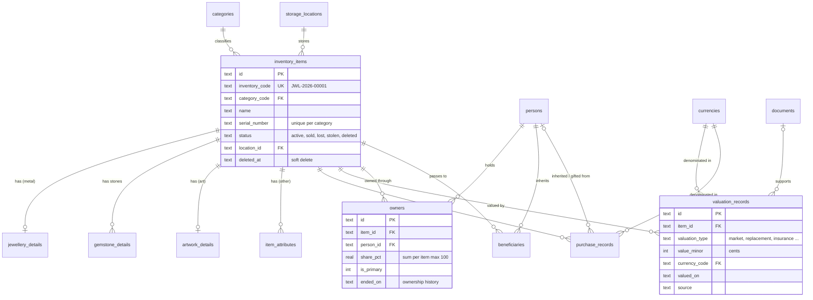
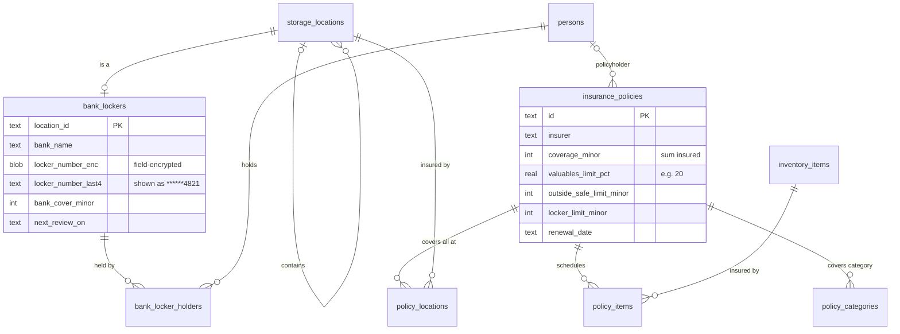
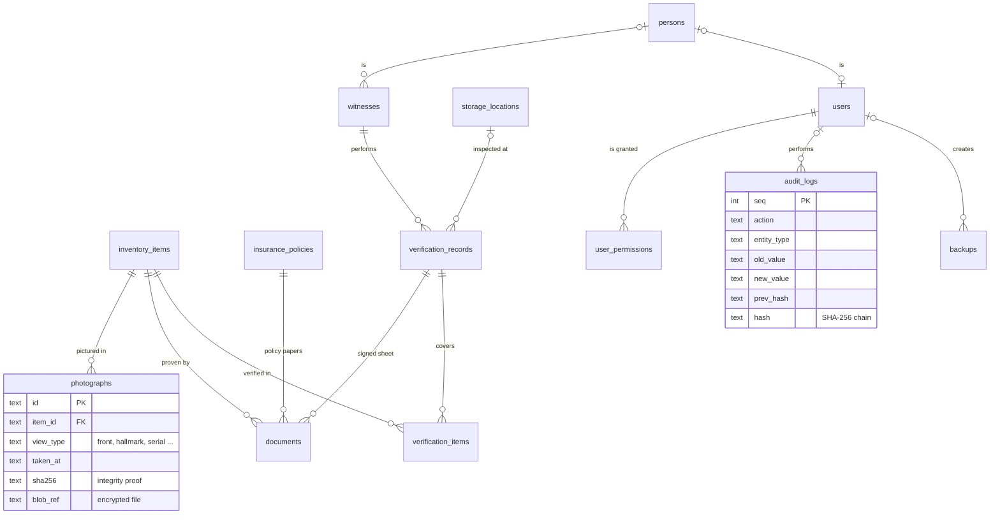

# Database design

Valuables Vault stores everything in **one relational database per vault**: SQLite with strict typing, encrypted as a whole with **SQLCipher** (AES-256) in the native app. The schema is in [`db/schema.sql`](../db/schema.sql) (version 1). Reference data is in [`db/reference_data.sql`](../db/reference_data.sql) and a complete sample vault in [`db/seed_sample.sql`](../db/seed_sample.sql). Reporting queries are in [`db/queries.sql`](../db/queries.sql).

Every table, rule and view is covered by automated tests ([`tests/test_db.py`](../tests/test_db.py), [`tests/test_db_queries.py`](../tests/test_db_queries.py)). A real backup from app version 0.9 migrates into the schema without loss ([`tools/vaultbak_to_sqlite.py`](../tools/vaultbak_to_sqlite.py), tested by [`tests/test_importer.py`](../tests/test_importer.py)).

## Entities

| Required entity | Table | Purpose |
|---|---|---|
| Users | `users`, `user_permissions` | Accounts that can unlock the vault; role, own wrapped encryption key, time-limited access; per-category / item / location permissions |
| Owners | `persons` + `owners` | People are stored once in `persons`; `owners` links them to items with ownership type, share % and history |
| Inventory Items | `inventory_items` | One row per valuable; business key `inventory_code` (e.g. `JWL-2026-00001`) |
| Categories | `categories` | JWL, GLD, DIA, WAT, COI, ART, ANT, ELE, DOC, OTH; which detail table applies; whether a certificate is expected |
| Jewellery Details | `jewellery_details` | Metal, purity (‰), karat and fine weight (computed), gross/net weight, hallmark, assay certificate |
| Gemstone Details | `gemstone_details` | One row per stone or stone group: 4Cs, fluorescence, lab, certificate number, laser inscription |
| Artwork Details | `artwork_details` | Artist, title, year, medium, size, signature, edition, provenance, certificates, restoration |
| *(other categories)* | `item_attributes` | Watch, coin, antique, electronics, document and dimension attributes as validated key/values |
| Purchase Records | `purchase_records` | Acquisition method, dates, seller, place, country, invoice number, price |
| Valuation Records | `valuation_records` | Dated values by type (purchase, market, replacement, insurance, appraised, estimated), source, valuer, document |
| Insurance Policies | `insurance_policies`, `policy_items`, `policy_locations`, `policy_categories` | Sum insured, deductible, every sub-limit, perils, renewal; what the policy covers |
| Storage Locations | `storage_locations` | Home, safes (certified or not), bank lockers, family members; nested (safe inside home) |
| Bank Lockers | `bank_lockers`, `bank_locker_holders` | Bank, branch, masked locker and agreement numbers, access authority, rent, bank cover, inspections |
| Documents | `documents` | Invoices, certificates, appraisals …, attached to exactly one item, policy, location or verification |
| Photographs | `photographs` | View type, caption, photographer, capture date and source (EXIF/file/manual), EXIF, thumbnail |
| Witnesses | `witnesses` | Witness identity, relationship, independence flag, masked ID reference |
| Verification Records | `verification_records`, `verification_items` | Who confirmed what, when and where; per-item *present* flag for locker checks; signature |
| Beneficiaries | `beneficiaries` | Intended heirs per item with optional share (a planning record — a will governs) |
| Audit Logs | `audit_logs` | Append-only, hash-chained history of every change and sensitive action |
| Backups | `backups` | Each backup with size, SHA-256, counts, password mode and verification result |
| *(support)* | `currencies`, `fx_rates`, `settings`, `import_runs` | Currency decimals, user-maintained exchange rates, thresholds, import history |

## Entity-relationship diagrams

### Items, ownership and valuation



### Storage, bank lockers and insurance



### Evidence, verification, users and audit



## Design rules

**Identifiers.** UUIDs as primary keys, so records can be created offline on desktop and phone and merged during sync without clashes. The readable `inventory_code` is unique, follows `CAT-YYYY-NNNNN`, and must start with the item's category.

**Money.** Integer minor units (cents, paisa) plus an ISO-4217 currency, never floating point. `currencies.minor_unit` knows the decimals (JPY has none). Totals convert with the user's own `fx_rates`; a value without a rate is excluded from totals rather than guessed.

**Market vs. insurance value.** Values are never a column on the item. `valuation_records` keeps every dated value with its type and source. `v_item_values` picks the latest *current* value (market, appraised or estimated), the latest *insurance* value (insurance or replacement) and the *exposure* (insurance, else current, else purchase).

**Encryption.** The whole database file is encrypted by SQLCipher (AES-256, key derived from the vault password with Argon2id). Locker numbers, agreement references, policy numbers and witness ID references get a second field-level encryption (`*_enc`), plus `*_last4` for masked display, so they stay protected in exports and memory dumps. Photos and documents are encrypted files outside the database (`blob_ref`); their plaintext SHA-256 proves they were not altered.

**Integrity rules enforced by the database** (each tested):

- category-specific values: diamond clarity grades, cut grades, metal types, valuation types, document and photo types, verification types
- ownership shares of an item never exceed 100 %, only one primary owner, beneficiary shares never exceed 100 %
- net metal weight ≤ gross weight; edition number ≤ edition size; renewal after start
- bank-locker details only on a bank-locker location; the *certified safe* flag only on safes; a locker inspection needs a location
- each document belongs to exactly one item, policy, location or verification
- auditor accounts must expire; a verified backup needs a verification time
- impossible dates (31 February), negative amounts and unknown currencies are rejected

**Deletion and history.** Items are soft-deleted first (`status = 'deleted'`, `deleted_at`). A hard delete (purge) is only possible from the recycle bin and cascades to details, ownership and evidence. `audit_logs` cannot be updated or deleted (triggers). Each entry carries a SHA-256 chained to the previous one, so tampering is detectable.

**Sync readiness.** Every user-editable table has `updated_at` and `updated_by_device` for field-level merges between desktop and phone (see the sync design in the specification).

**Versioning.** `PRAGMA user_version` holds the schema version (1). Migrations are numbered SQL files applied in order on unlock, inside a transaction, after an automatic backup.

## Views

| View | Answers |
|---|---|
| `v_item_values` | What did it cost, what is it worth today, what is its insurance value — in the base currency |
| `v_item_documentation` | Documentation score (0–100) and what is missing, with the same rules as the app |
| `v_item_policies` | Which policies cover an item (scheduled items + covered locations) |
| `v_policy_coverage` | Is it adequately insured: covered value vs. sum insured, valuables sub-limit and locker limit; status `under_insured` / `adequately_insured` / `potentially_over_insured` |
| `v_locker_contents` | Locker contents value vs. the bank's own cover, inspection dates, masked number |
| `v_valuations_all` | Full valuation history including purchase prices (chart data) |

With the sample data the views return exactly the figures the app shows: purchase €22,400, current €27,420, insurance €18,500; `JWL-2026-00001` 100 % documented; the household policy under-insured because valuables of €21,700 exceed its 20 % sub-limit of €19,000.

## Trying it

```bash
sqlite3 sample.db < db/schema.sql
sqlite3 sample.db < db/reference_data.sql
sqlite3 sample.db < db/seed_sample.sql
sqlite3 -header -column sample.db "SELECT inventory_code, score, missing FROM v_item_documentation;"
sqlite3 -header -column sample.db "SELECT insurer, status, valuables_value_base, valuables_limit_base FROM v_policy_coverage;"
```

Migrate your own backup from the app (check only — nothing is written):

```bash
pip install cryptography
python3 tools/vaultbak_to_sqlite.py my-backup.vaultbak
```

`--out file.db` also writes the database. That file is **not encrypted** (confidential numbers are reduced to their last four digits, files are referenced, not copied): use it only on an encrypted disk and delete it afterwards.
